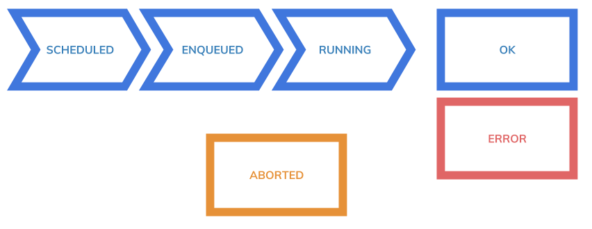

# Testing

## Testing Lifecycle




## Requesting a test

A test can be requested though curl.

```
$ curl -v -H'content-type:application/json' -H"x-auth-token:${TOKEN}" -d'
{
	"name": "mytest",
	"durationTimeMillis": 10000,
	"project": "grouproject",
	"tags": ["dsfdsfdsfds", "sdfsdfds", "23312 fsdfds", "d3f434", "rsdfsd", "fdsdfsdfsd"],
	"notify": ["mailto:root@localhost.localdomain", "http://mywebhook.localhost.localdomain"],
	"properties": {
		"requests": [{
				"order": 1,
				"uri": "https://www.bing.com"
			},
			{
				"order": 2,
				"uri": "https://httpbin.org/post",
				"method": "POST",
				"headers": [{
					"content-type": "application/json"
				}],
				"body": "{ \"id\": \"test\" }"
			},
			{
				"order": 3,
				"uri": "https://httpbin.org/post",
				"method": "POST",
				"headers": [{
					"content-type": "application/json"
				}],
				"body": "{ \"id\": \"test\" }",
				"auth": [{
						"credentials": "admin:password"
					},
					{
						"preemptive": "true"
					}
				]
			},
			{
				"order": 4,
				"uri": "https://httpbin.org/post",
				"method": "POST",
				"headers": [{
					"content-type": "application/x-www-form-urlencoded"
				}],
				"body": "login=admin&pass=password",
				"saveCookies": true
			}
		],
		"numConn": 1000,
		"parallelLoaders": 1,
		"followRedirect": true,
		"monitTargets": "zero://target1,zero://target2"
	}
}' http://127.0.0.1:8080/tests
```

## Requesting with a JSON files

A JSON file can also be used for requesting a test.

### Request

```
$ curl -H'content-type:application/json' \
 -H"x-auth-token:${TOKEN}" \
 -d @file.json \
 http://127.0.0.1:8000/tests
```

```
json
file.json

{
	"name": "mytest",
	"durationTimeMillis": 10000,
	"project": "grouproject",
	"tags": ["dsfdsfdsfds", "sdfsdfds", "23312 fsdfds", "d3f434", "rsdfsd", "fdsdfsdfsd"],
	"notify": ["mailto:root@localhost.localdomain", "http://mywebhook.localhost.localdomain"],
	"properties": {
		"requests": [{
				"order": 1,
				"uri": "https://www.bing.com"
			},
			{
				"order": 2,
				"uri": "https://httpbin.org/post",
				"method": "POST",
				"headers": [{
					"content-type": "application/json"
				}],
				"body": "{ \"id\": \"test\" }"
			},
			{
				"order": 3,
				"uri": "https://httpbin.org/post",
				"method": "POST",
				"headers": [{
					"content-type": "application/json"
				}],
				"body": "{ \"id\": \"test\" }",
				"auth": [{
						"credentials": "admin:password"
					},
					{
						"preemptive": "true"
					}
				]
			},
			{
				"order": 4,
				"uri": "https://httpbin.org/post",
				"method": "POST",
				"headers": [{
					"content-type": "application/x-www-form-urlencoded"
				}],
				"body": "login=admin&pass=password",
				"saveCookies": true
			}
		],
		"numConn": 1000,
		"parallelLoaders": 1,
		"followRedirect": true,
		"monitTargets": "zero://target1,zero://target2"
	}
}
```

### Response

```
{
  "createdBy" : "grouadmin",
  "createdDate" : "2017-11-10T18:30:42.967+0000",
  "lastModifiedBy" : "grouadmin",
  "lastModifiedDate" : "2017-11-10T18:30:42.982+0000",
  "name" : "mytest",
  "project" : "grouproject",
  "loaders" : [ ],
  "properties" : {
    "requests" : [ {
      "order" : 1,
      "uri" : "https://www.bing.com"
    }, {
      "order" : 2,
      "uri" : "https://httpbin.org/post",
      "method" : "POST",
      "headers" : [ {
        "content-type" : "application/json"
      } ],
      "body" : "{ \"id\": \"test\" }"
    }, {
      "order" : 3,
      "uri" : "https://httpbin.org/post",
      "method" : "POST",
      "headers" : [ {
        "content-type" : "application/json"
      } ],
      "body" : "{ \"id\": \"test\" }",
      "auth" : [ {
        "credentials" : "admin:password"
      }, {
        "preemptive" : "true"
      } ]
    }, {
      "order" : 4,
      "uri" : "https://httpbin.org/post",
      "method" : "POST",
      "headers" : [ {
        "content-type" : "application/x-www-form-urlencoded"
      } ],
      "body" : "login=admin&pass=password",
      "saveCookies" : true
    } ],
    "numConn" : 1000,
    "parallelLoaders" : 1,
    "followRedirect" : true,
    "monitTargets" : "zero://target1,zero://target2"
  },
  "tags" : [ "sdfsdfds", "rsdfsd", "dsfdsfdsfds", "fdsdfsdfsd", "23312 fsdfds", "d3f434" ],
  "status" : "ENQUEUED",
  "result" : null,
  "notify" : [ "http://mywebhook.localhost.localdomain", "mailto:root@localhost.localdomain" ],
  "dashboard" : "http://127.0.0.1:3000/dashboard/db/grou?refresh=5s&orgId=1&var-project=grouadminproject&var-alltags=23312fsdfdsd3f434dsfdsfdsfdsfdsdfsdfsdrsdfsdsdfsdfds&from=now-2m&to=now",
  "durationTimeMillis" : 10000,
  "_links" : {
    "self" : {
      "href" : "http://127.0.0.1:8000/tests/5a05f0524e4e413d4833ccab"
    },
    "test" : {
      "href" : "http://127.0.0.1:8000/tests/5a05f0524e4e413d4833ccab"
    }
  }
}
```

### Results with Grafana

The JSON response gives a url to a Grafana (usually running on port 3000) where the test metrics can followed.


## List projects and tests

```
$ curl -v -H'content-type:application/json' http://127.0.0.1:8080/tests
```
